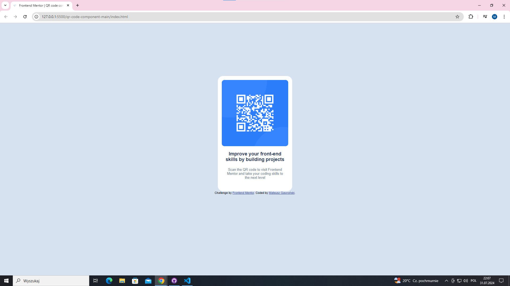

# Frontend Mentor - QR code component solution

This is a solution to the [QR code component challenge on Frontend Mentor](https://www.frontendmentor.io/challenges/qr-code-component-iux_sIO_H). Frontend Mentor challenges help you improve your coding skills by building realistic projects. 

## Table of contents

- [Overview](#overview)
  - [Screenshot](#screenshot)
  - [Links](#links)
- [My process](#my-process)
  - [Built with](#built-with)
  - [What I learned](#what-i-learned)
  - [Continued development](#continued-development)
  - [Useful resources](#useful-resources)
- [Author](#author)
- [Acknowledgments](#acknowledgments)

## Overview

### Screenshot



### Links

- Solution URL: [Solution URL here](https://github.com/Garoo0/The-first-website-design-with-positioning)
- Live Site URL: [Live site URL here](https://garoo0.github.io/The-first-website-design-with-positioning/)

## My process

### Built with

- Basic HTML5 positioning and elements
- CSS custom properties
- [Styled sheet](https://fonts.google.com/specimen/Outfit) - Fonts

### What I learned

How to add fonts from internet links.
```css
font-family: "Outfit", sans-serif;
```

I remembered basic work with classes, styles and positioning elements.
```css
.container {
      background-color: white;
      width: 280px;
      height: 420px;
      border-radius: 20px;
      padding-top:15px;
      text-align:center;
      margin-block-start:200px;
      margin-inline:auto;
}
```

### Continued development

I feel good with styling elements, but i had huge problem with getting all content in central side. I overcombined simple thing and ended with "grid" and "flex". So in future i would like to get familiar with more advanced technics for ordering elements and to achieve ability to differentiate what i need and what resolve is best.

### Useful resources

- [w3schools](https://www.w3schools.com/css/css_margin.asp) - This helped me with easiest way to position my content and other usefull css styles with examples. I really liked this pattern and will use it going forward.

- [internet] - Mostly i used it to find small things. How this cammend looked like or wchich commend is closest to what i need.
## Author

- Frontend Mentor - [@Garoo0](https://www.frontendmentor.io/profile/Garoo0)

## Acknowledgments

Thanks to Frontend Mentor for this project. I wanted to start my development on webs and found challenge which pushed me to do first steps. Even if it's one small thing for now 😉.